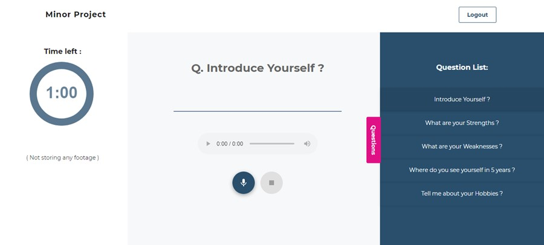
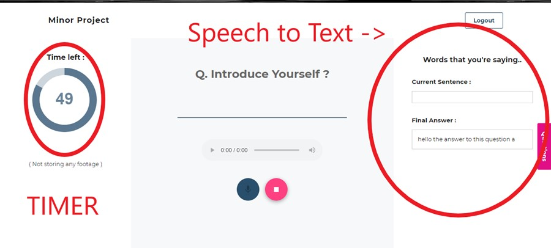

# Automated Interview Preparation
### Working Demo: <a href="https://minorproject.netlify.com/">minorproject.netlify.com</a> 

🌟🌟 The <b>Automated Scroring Model</b>  is not currently deployed and can be accessed by running at local server. See working demo and steps to run locally below 

<b> Project Wiki: </b> <a href="https://github.com/prankshaw/minor-project-2019/wiki">github.com/prankshaw/minor-project-2019/wiki</a>

The Project is a <b>Deep-Learning based Interview preparation platform</b> including functionalities such as 
<ul>
  <li> <a href="#virtual-mock-interview-platform">Virtual Mock interview Platform</a> </li>
  <li> <a href="#automated-scoring-model">Automated Essay and Assignment Scoring</a></li>
  <li> <a href="#smart-plagiarism-checker">Smart Plagiarism Checker</a> </li> 
  <li> Automated test platform <b>(Deprecated)</b></li>
</ul>

## Virtual Mock interview Platform
<b> Why Read, Try it yourself- <a href="https://minorproject.netlify.com/audio-practice">minorproject.netlify.com/audio-practice</a></b>
<ul>
  <li><b>Operations of Working-</b></li> Users can practice live interview by choosing from a desired set of questions. We included the live interview question panel, microphone, and video (camera) options, allowing the user to improve see how they passively react and improve themselves. Users can now click the play button, after choosing the desired questions and can answer them, which will be recorded and can be replayed. 

 Basic Layout              |  Working Structure
:-------------------------:|:-------------------------:
  |  

<li><b>Model Description-</b> The <b>Recurrent Neural Network</b> are to be used for <b>Text to Speech model</b>. Existing <b>Web speech API with custom wrapper</b> is employed for a better accuracy.</li>
</ul>

## Automated Scoring Model
🌟🌟 The <b>Automated Scroring Model</b>  is not currently deployed and can be accessed by running at local server.
<ul>
<li><b>Operations of Working-</b> Users will be given an option of choosing from a set of questions with minimum and maximum scores assigned to them. After choosing a certain question, a descriptive question will be available to them, using which they can enhance their understanding of the question. The model will test their usage of vocabulary, context-driven word usage, analysis of speech used, grammatical and spelling errors, length and structure of essay submitted and various other factors to provide a score.</li>

  

<li><b>Model Description-</b>  The model's accuracy is calculated by <b>Quadratic Weighted Kappa(QWK)</b>, which measures the agreement between two raters. The model architecture consists of 2 Long Short Term Memory(LSTM) layers with a Dense output layer. The final layer uses the Relu activation function. The QWK is calculated by training model on the dataset using 5-Fold Cross Validation and taking the average for all five folds.</li>
</ul>  
  
## Smart Plagiarism Checker
It is an inbuilt functionality in the Automated Scoring Model. 
<ul>
<li><b>Operations of Working-</b> Whenever an Answer Essay is typed for a certain question, the plagiarism checker checks the essays for plaigiarism using its database and results obtained from prevous answers and web crawling and return a number of resources with which essay has matched along with their URLs, titles, and percentage of content matched. The result of plagiarism will be mailed to the user instantly after the generation of the automated scores. </li>
<li><b>Model Description-</b> <b>Frequent-itemset analysis,</b> also known as market-basket analysis or affinity analysis, can be used for plagiarism detection. It works by treating documents as items and sentences in all the documents as baskets. Then, it tries to find documents that appear together in multiple baskets (have same sentences). In the book Mining of Massive Datasets , it is pointed out that one or two sentences in common among documents is already a good indicator of plagiarism in practice. Rabink karp and KMP algo can be used for string matching. To get better prediction, we employed Copyleaks API.</li>
</ul>  

### Development Team
The project was build by <a href="https://github.com/prankshaw">Pranjal Rastogi</a>, <a href="https://github.com/Puranjay25">Puranjay Makhija</a>, <a href="https://github.com/hemant-garg">Hemant Garg</a>

<!--
### If you want to visit the working functionalities without signing in, visit from here: 
<strong> Live Interview Practice : <a href="https://minorproject.netlify.com/audio-practice">minorproject.netlify.com/audio-practice</a></strong>  
<strong> Essay Writing with Automated scoring and Plagiarism Checker: <a href="https://minorproject.netlify.com/audio-practice">minorproject.netlify.com/audio-practice</a></strong>  

<li><b>Read more about the project here: </b>
  <a href="https://prankshaw.github.io/minor-project-2019/">prankshaw.github.io/minor-project-2019</a></li>
<li><b> Project Wiki: </b>
  <a href="https://github.com/prankshaw/minor-project-2019/wiki">github.com/prankshaw/minor-project-2019/wiki</a></li>
 
## Important Links
<li> Automated Scoring- https://automatedscoring.herokuapp.com/  </li>
<li> Landing Page- https://minorproject.netlify.com </li>
-->  
## Work in Progress ⚒ 🏭
